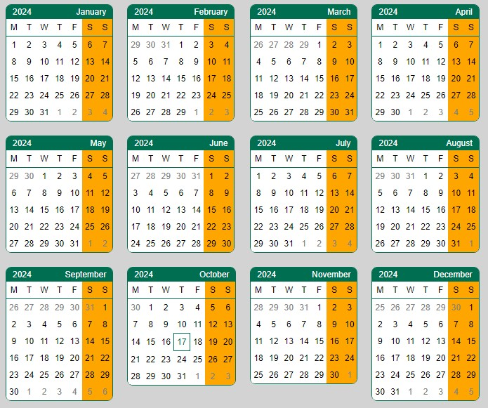
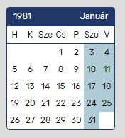

# Simple Calendar Flow (for Vaadin 24.4+)

Version: 1.0.0

Author: Károly Kótay-Szabó (gl0b3)

Source on GitHub: [https://github.com/gl0b3/simple-calendar-flow](https://github.com/gl0b3/simple-calendar-flow)\
Vaadin addon page: [https://vaadin.com/directory/component/simple-calendar](https://vaadin.com/directory/component/simple-calendar)

## Overview

The Simple Calendar Flow (Java) module is a Vaadin 24.4+ addon. It uses the `simple-calendar` JS / Lit custom element. See it on GitHub: https://github.com/gl0b3/simple-calendar .\
It designed to visually displaying a month or all months of a given year in table form.
The components can be imported into your own Vaadin project and can be customized in terms of date and style, including language localization.
If you want, you can use only the Month Calendar component or only the Year Calendar component or even both within a project.

Year Calendar for 2024 in English with 'year-is-first' option and narrowed weekdays format:\


## Used technologies

Java: Version 17, so that we can wrap up the Simple Calendar Javascript package and the components within it into components that can be used for Vaadin Flow. More info: https://www.java.com
* Vaadin Flow: version 24.4+, the framework with which we can create web applications and addons in Java. More info: https://vaadin.com/
* Lit: to make the client side `simple-calendar` NPM package, which holds the `month-calendar` and the `year-calendar` components. More info: https://lit.dev/
* Maven: the dependency handling and building tool. More info: https://maven.apache.org/

## Install

In your project's `pom.xml` you have to put this dependency into your `<project><dependencies>...</dependencies></project>` part:

```xml
<dependency>
    <groupId>org.vaadin.addons.gl0b3</groupId>
    <artifactId>simple-calendar-flow</artifactId>
    <version>1.0.0</version>
</dependency>
```

Add the `vaadin-addons` repository to your `pom.xml` into your `<project><repositories>...</project></repositories>` part so Maven will be able to download the dependency:
```xml
<repository>
   <id>vaadin-addons</id>
   <url>http://maven.vaadin.com/vaadin-addons</url>
</repository>
```

## Build

After you updated your `pom.xml`, you can build your project with the Simple Calendar addon by type the following command:
```bash
mvn clean package
```
or
```bash
mvn clean install
```

to install your project artifact into your local Maven repository.
## Month Calendar

This component displays a month - admit it, you never thought it! :)

You can set the following properties:

| Property           | Type                                   | Description                                                                                                                                                                                                                                                                                                                                              | Default value                               | Example value |
|--------------------|----------------------------------------|----------------------------------------------------------------------------------------------------------------------------------------------------------------------------------------------------------------------------------------------------------------------------------------------------------------------------------------------------------|---------------------------------------------|---------------|
| year               | int                                    | The year whose month we want to display.                                                                                                                                                                                                                                                                                                                 | java.time.YearMonth.now().getYear()         | 2024          |
| month              | int                                    | The month we want to display. Note: 1-12 values.                                                                                                                                                                                                                                                                                                         | YearMonth.now().getMonthValue()             | 5             |
| locale             | String                                 | The month and days name in the given language. More info: https://moment.github.io/luxon/api-docs/index.html                                                                                                                                                                                                                                             | java.util.Locale.getDefault().getLanguage() | "en" or de"   |
| yearIsFirst        | boolean                                | The order of the year and the month in the month calendar's header. yearIsFirst = true -> year then month. yearIsFrist = false -> month then year                                                                                                                                                                                                        | true | true          |
| dayNameType        | DayNameType enum (NARROW, SHORT, LONG) | the format of naming days (monday, tuesday,... or M, T, ...). NARROW = initial letter, SHORT = abbreviated, LONG = long or full written.                                                                                                                                                                                                                 | SHORT | NARROW        
| showOtherMonthDays | boolean                                | If you set to 'true', then the the whole weeks will be shown, if you set to false (or leave it on default) then only days which are in the current month will be visible. Ie.: first week of October 2024 begins on September 30, and last week ends with November 1, 2 and 3. Mor info: https://moment.github.io/luxon/api-docs/index.html#infoweekdays | false | true          |

### Basic Usage

If you call the constructor without parameters, then the default values take effect.
```java
import org.vaadin.addons.gl0b3.simplecalendar.MonthCalendar;
//...
MonthCalendar monthCalendar = new MonthCalendar();
// year: actual year, month: actual month, yearIsFirst: true,
// locale: system default locale, dayNameType: SHORT, showOtherMonthDays: false
layout.add(monthCalendar);
```

Create a Month Calendar for January 1981 with hungarian language:



```java
import org.vaadin.addons.gl0b3.simplecalendar.MonthCalendar;
//...
MonthCalendar monthCalendar = new MonthCalendar(1981, 1, "hu");
layout.add(monthCalendar);
```

Or you can use the fluent API to build more elegant objects. Good to know is you set the properties after instantiation you have to call the `refresh()` method:

```java
import org.vaadin.addons.gl0b3.simplecalendar.MonthCalendar;
//...
MonthCalendar monthCalendar = new MonthCalendar();
layout.add(monthCalendar);
monthCalendar.setYear(2024)
        .setMonth(1)
        .setLocale("de")
        .setDayNameFormat(DayNamFormat.NARROW())
        .setYearIsFirst(true)
        .setShowOtherMonthDays(true);
monthCalendar.refresh();
```

The `refresh()` method send all the properties to the client side (JS component) which makes the changes visible.
If you want to change just a field, like year, you should call `refreshYear(int)` method. If you want to set the MonthCalendar fields but don't want to send the changed to client, just use the setter methods without a refresh method call.

## Year Calendar

The Year Calendar component displays the months of the year. On the client side, the Year Calendar uses the Month Calendar to render the months.

The Year Calendar has the following properties to configure the component:

| Property           | Type                                   | Description                                                                                                                                                                                                                                                                                                                                              | Default value                               | Example value |
|--------------------|----------------------------------------|----------------------------------------------------------------------------------------------------------------------------------------------------------------------------------------------------------------------------------------------------------------------------------------------------------------------------------------------------------|---------------------------------------------|---------------|
| year               | int                                    | The year whose month we want to display.                                                                                                                                                                                                                                                                                                                 | java.time.YearMonth.now().getYear()         | 2024          |
| locale             | String                                 | The month and days name in the given language. More info: https://moment.github.io/luxon/api-docs/index.html                                                                                                                                                                                                                                             | java.util.Locale.getDefault().getLanguage() | "en" or de"   |
| yearIsFirst        | boolean                                | The month calendar the order of the year and the month in the header. yearIsFirst = true -> year then month. yearIsFrist = false -> month then year                                                                                                                                                                                                      | true | true          |
| dayNameType        | DayNameType enum (NARROW, SHORT, LONG) | the format of naming days (monday, tuesday,... or M, T, ...). NARROW = initial letter, SHORT = abbreviated, LONG = long or full written.                                                                                                                                                                                                                 | SHORT | NARROW        
| showOtherMonthDays | boolean                                | If you set to 'true', then the the whole weeks will be shown, if you set to false (or leave it on default) then only days which are in the current month will be visible. Ie.: first week of October 2024 begins on September 30, and last week ends with November 1, 2 and 3. Mor info: https://moment.github.io/luxon/api-docs/index.html#infoweekdays | false | true          |

When you change a property, it's changes the underlying months property. Ie. if you change the year, it changes all of the months year in the background (on the client side).

### Basic Usage

Year Calendar usage is similar to Month Calendar, the only difference is that there is no month field.

The parameterless constructor instantiate a Year Calendar with default values:

```java
import org.vaadin.addons.gl0b3.simplecalendar.YearCalendar;
//...
YearCalendar yearCalendar = new YearCalendar();
// year: actual year, yearIsFirst: true, locale: system default locale,
// dayNameType: SHORT, showOtherMonthDays: false
layout.add(yearCalendar);
```

Similar to Month Calendar you can use the fluent API. After that you have to call the `refresh()` method to send property changes to the client side:

```java
import org.vaadin.addons.gl0b3.simplecalendar.YearCalendar;
//...
YearCalendar yearCalendar = new YearCalendar();
layout.add(yearCalendar);
// there are other fields, but we only set these two
yearCalendar.setYear(1981).setLocale("hu");
monthCalendar.refresh();
```

### Style customization

The componets use Shadow DOM and Shadow CSS, which means the classic styling cannot be applied. The use of CSS variables tries to overcome this difficulty.
The following variables are declared with initial values. If you want to customize, you have to modify the corresponding value in your application's `styles.css` (typically in the html { ... } or body { ... } part):

### Year Calendar customization

`year-calendar` has only a few CSS variables, it can only control the gaps between the `month-calendar`s:
```css
--year-month-gap-top: 0;
--year-month-gap-right: 20px;
--year-month-gap-bottom: 20px;
--year-month-gap-left: 0;
```

For example if you want to disable the gaps between the month calendars you can set the right and bottom gaps to zero too (as the initial top and left gaps are):
```css
--year-month-gap-right: 0;
--year-month-gap-bottom: 0;
```

### Month Calendar customization

The Month Calendar has many more setting options. The list of CSS variables can be found here:

`month-calendar` CSS variables are the following:
```css
--month-primary-color: #006E51;
--month-secondary-color: #FFA500;
--month-day-color: #000000;
--month-font-family: Arial;
--month-font-size: 12px;
--month-table-border: 1px solid var(--month-primary-color);
--month-table-border-radius: 8px 8px 8px 8px;
--month-table-last-row-bottom-radius: 0 0 8px 8px;
--month-last-row-border-bottom-left-radius: 0 0 0 6px;
--month-last-row-border-bottom-right-radius: 0 0 6px 0;
--month-day-cell-width: 1.8em;
--month-day-cell-height: 24px;
--month-day-font-weight: normal;
--month-day-background-color: #FFFFFF;
--month-day-user-select: none;
--month-today-background-color: #FFFFFF;
--month-today-color: var(--month-primary-color);
--month-today-border: var(--month-today-border-width, 1px) var(--month-today-border-style, solid) var(--month-today-color);
--month-today-user-select: none;
--month-weekdays-weekend-background-color: var(--month-secondary-color);
--month-weekdays-border-bottom: 1px solid var(--month-primary-color);
--month-weekdays-background-color: #FFFFFF;
--month-header-padding-top: 1px;
--month-header-padding-right: 4px;
--month-header-padding-bottom: 1px;
--month-header-padding-left: 4px;
--month-header-border-top-left-radius: 6px;
--month-header-border-top-right-radius: 6px;
--month-header-background-color: var(--month-primary-color);
--month-header-color: #ffffff;
--month-header-user-select: none;
--month-day-hover-color: inherit;
--month-day-hover-background-color: #D5D5D5;
--month-othermonth-day-color: #838383;
--month-inactive-day-background-color: #FFA500;
--month-important-day-background-color: var(--month-secondary-color);
--month-weeks-weekend-background-color: var(--month-secondary-color);
--month-box-shadow-color: #98A3AE;
--month-table-hover-box-shadow: 3px 3px 5px 0 var(--month-box-shadow-color);
--month-table-hover-transition: .1s ease-in-out;
--month-table-hover-scale: 1.05;
```

The names of the variables are self-explanatory, and in the browser's Developer mode, you can inspect which style and which variable applies to which element.

### Let's see some examples:

Change the base font of the library, like header's text, day, etc. to 'Verdana' ('sans-serif' for fallback safety) with size 14px:
```css
--month-font-family: Verdana, sans-serif;
--month-font-size: 14px;
```

Change the header background color to blue, the text color to gray and the border to 2px thick, solid style and blue color:
```css
--month-header-background-color: #065DAB;
--month-header-color: #C4C8CB;
--month-table-border: 2px solid #065DAB;
```

If you want to use a color for primary, set the following value (the header background color and the border color use this variable):
```css
--month-primary-color: #065DAB;
```

To change the weekend names color to light green:
```css
--month-weekdays-weekend-background-color: #96EAC8;
```

To change the weekend dates color to light blue:
```css
--month-weeks-weekend-background-color: #A1CCEB;
```

Weekend days use the secondary color, so changing the secondary color will affect to the weekend days color (if you don't modify the --month-weekend-background-color too). For example, the secondary color can be the previous light blue:
```css
--month-secondary-color: #A1CCEB;
```

Turn off the table's hover animation:
```css
--month-table-hover-transition: none;
--month-table-hover-scale: none;
```

If you don't want to use box shadow when hover over the table, you can turn off:
```css
--month-table-hover-box-shadow: none;
```

## Known limitations

- The week starts on Monday and ends on Sunday, as I think it normally should (ISO 8601). Some nations still do not use this due to their tradition, but this is not currently supported by the program. Perhaps in the future it will be possible to configure this as well.
- The layout of the year is fixed, the months are displayed in 3 rows and 4 columns in tabular form. This is currently not customizable either. If you want to display it differently, the solution may be to pack 12 individual months from January to December and display them as you like with HTML and CSS options.
- Limitations due to Shadow DOM and Shadow CSS. If you want to customize the look more, you can use Javascript to get into the shadow CSS.

## License

The project uses Apache 2.0 license. For more info see the LICENSE file.

## More information

See the links on the top of the page.
